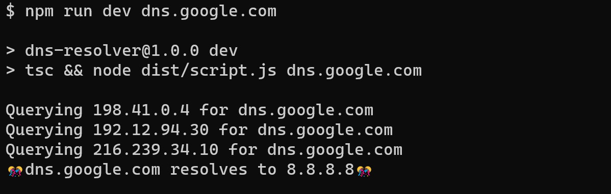

# Challenge 2 - Dns Resolver

DNS Resolver built form scratch that resolves domain names to IP addresses.

## Installation

1. Clone the repository: `git clone <repository_url>`
2. Install dependencies: `npm install`

## Usage

1. Open a terminal in the project directory.
2. Run the following command to start the application:

   ```shell
   npm run dev <domain_name>

## Output

